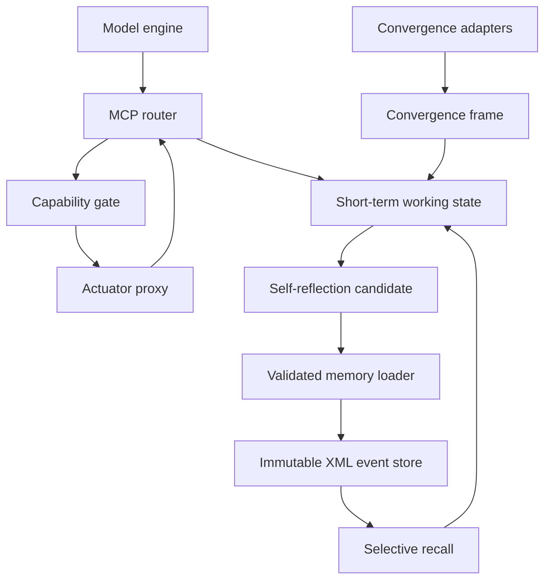

# File: `Genesis/Shakti_MCP/FULL_PIPELINE.md`

Status: contract-only beyond the tested router footing
Authority: MCP end-to-end build architecture
Version: 1
Last verified: 2026-07-17

## Introduction

This document maps the complete intended flow from a host-admitted model cycle
through routing, capability control, working state, convergence, reflection,
immutable XML loading, and selective recall.

## Start and end points

Start: the engine receives one admitted loopback bundle.
End: a validated long-term block remains immutable while a selected copy may be
attached temporarily to a later loopback bundle.

## Related documents

- `../../docs/MASTER_ARCHITECTURE.md` — project topology and completion status.
- `HOST_CONTRACT.md` — exact host/router ownership boundary.
- `ROUTE_MAP.md` — the nine route modules that implement the switchboard.
- `schemas/README.md` — XML contracts for convergence and immutable memory.

## Definitions

- **Loopback bundle**: one bounded, self-contained input to a model cycle.
- **Capability gate**: host-owned allow/refuse/drain decision before an actuator.
- **Candidate**: staged reflection that has not passed durable-loader validation.
- **Recall copy**: temporary context copied from an unchanged archive block.

## Admitted status

- The nine-route C17 switchboard and cycle controller are implemented locally.
- Tool execution, notes, reminders, XML persistence, reflection loading, recall,
  and convergence ingestion remain honest stubs or contracts.
- `tool_menu.xml` is the only operational XML configuration in the footing.
- The XSDs and examples under `schemas/` define the next build boundary; their
  presence does not mean storage or recall has been implemented.

## End-to-end topology

The model never writes XML files, chooses filesystem paths, or bypasses the
capability gate. It supplies semantic content and intentions. C supplies IDs,
parent links, fixed task time, validation, bounds, state transitions, receipts,
and refusal.

Visible witnessed-event identity is
`<frozen called_epoch>-<circuit/subsystem>-<firing order>`. Circuit roots are
uppercase (`A`, `B`, `C`); nested subsystem letters are lowercase (`Aa`, `Ab`,
`Aba`); the final integer is assigned by C in actual firing order. The internal
cycle sequence remains checkpoint-only diagnostics and is not serialized into
the event ID.

## Input and output contracts

| Boundary | Input | Output |
|---|---|---|
| Host to engine | One loopback bundle: current message, short-term history, recalled blocks, called item/result, convergence summary, instructions. | Model text plus zero or more typed command intentions. |
| Router to capability gate | Route, operation, payload, actor established by host, task/cycle ID. | `ALLOW`, `REFUSE`, or `DRAIN`; permitted operation gets an operation ID. |
| Actuator to router | Operation ID, `PASS` or `FAIL`, canonical result text. | Same cycle resumes; task time and identity do not move. |
| Convergence adapter to working state | Ordered observations with modality, source ID, source sequence, confidence, and canonical text/reference. | One bounded `ShaktiConvergenceFrame`. |
| Working state to reflection | Witnessed batch, selected convergence frame, model reflection, evidence labels, optional correction link. | One `ShaktiReflectionCandidate`; not memory yet. |
| Candidate to memory loader | Typed candidate owned by code, complete serialized-size check, target schema version. | Commit receipt or named refusal. |
| XML archive to recall selector | Exact ID, relationship ID, tag, or bounded time range plus maximum block count. | Read-only `ShaktiRecallSet` copied into short-term context. |

The public fixed-buffer C shapes live in
`include/shakti_memory_contract.h`. The wire/storage shapes live under
`schemas/`.

## Self-reflection and long-term loading

Reflection is a candidate, not automatically a fact.

1. Route 9 receives `reflect <batch_id>` and loads the witnessed batch plus any
   selected convergence frame into the active short-term cycle.
2. Shakti supplies reflection text, evidence class, and an optional relationship
   such as `corrects_event_id`.
3. C constructs the candidate ID, frozen event address, origin, and bounds.
4. `remember <candidate_id>` asks the loader to validate schema fields, XML
   characters, references, and complete serialized size.
5. The host writes a unique pending file, flushes it, closes it, reopens and
   validates it, then atomically promotes it to a never-before-used final key.
6. Only a verified promotion produces `committed=true`. Failure leaves a named
   refusal or recoverable pending artifact; it never fakes memory.

The archive is append-only through this API. A correction creates a new event
linked to the original. It never rewrites the original event.

## Selective recall

Recall never edits long-term memory.

1. Shakti or the host makes a bounded request: exact ID first; later signed
   deterministic selectors may use links, tags, and time ranges.
2. The selector reads immutable XML and verifies its schema and identity.
3. It renders a bounded text copy into `ShaktiRecallSet`.
4. The loopback builder places those blocks in the next active short-term
   context with source event IDs.
5. `recall dismiss <set_id>` drops the copies only.

Relevance ranking, embeddings, and probabilistic recall are not admitted here.
They require their own explicit design and tests.

## Convergence and the valuation/feeling question

Convergence has its own temporary stream; it is not silently merged with router
history or long-term memory. A frame joins observations that share the active
task identity while preserving each source ID and sequence.

The measurable place for a feeling-like candidate is a
`ShaktiValuationSnapshot` inside the current convergence frame and short-term
working state. It contains bounded values for valence, arousal, urgency,
approach, avoidance, uncertainty, and novelty plus an evidence class and basis.

This is an engineering representation of active valuation, not proof that a
subjective feeling exists or that RAM alone creates consciousness. If Shakti
reports a state, it is labeled `REPORTED`; if code derives it, `INFERRED`; an
untested theory is `HYPOTHESIS`; missing knowledge is `UNKNOWN`. If selected for
long-term memory, the exact labeled snapshot is copied into the event.

Company secrecy, competitive behavior, or missing search results are not enough
to establish where subjective experience exists. This architecture therefore
preserves the question and its evidence without turning the claim into a fact.

## Control laws

- `continue` requests exactly one additional inference for the unfinished task
  after confirmed completion; it preserves the original task call time.
- Heartbeat is a separate bounded wake invitation that starts a new task.
- `heartbeat off` cancels future wakes and runway, then drains active work.
- The capability proxy can independently be open, restricted, draining, or off.
- Notes and ordinary command results are same-cycle side effects and never
  reprompt Shakti.
- The host owns app-local persistence and checkpoints. Shakti receives no wider
  device authority.
- All events inside a task use the epoch captured when the task was called.

## Rest, cruise, and focus are different modes

Heartbeat supplies the bounded wake pulse for cruise. Runway continuation is a
different mechanism.

| Mode | Model activity | Context and authority |
|---|---|---|
| `REST` | No inference. C may maintain queues, checkpoints, and due-state. | No tool action. |
| `CRUISE` | Sparse host-scheduled school/study cycles with a small token, reasoning, and daily-cycle budget. | Read-only curriculum and memory recall; actuators off by default. |
| `FOCUS` | Full task work triggered by Tyler, an admitted reminder, a real result, or an approved escalation. | Capability gate decides each actuator request. |
| `QUIET_REFLECTION` | Sparse minimal-context reflection calls for a bounded host-controlled window. | All actuators off; reflections stage temporarily and do not auto-commit. |
| `OFF` | No new model cycles; active work drains under the stop law. | Proxies close after drain. |

`continue` extends the current task when it runs out of response runway. A
heartbeat starts a new low-priority study/check-in task; it cannot inherit an
unfinished focus task or accumulate missed pulses. Tyler input preempts cruise.
Cruise may request focus, but host policy decides whether escalation is admitted.
Continuous or repeated inference is an operational stream; it does not by
itself establish subjective experience.

`QUIET_REFLECTION` is the recovery state for a requested interval such as ten
minutes. The host first puts the tool proxy in `OFF` or `DRAIN`, then supplies a
minimal neutral envelope containing only current short-term history and the
instruction to observe, reflect, and complete. It uses a monotonic deadline for
the recovery window; each admitted reflection still receives its own frozen
wall-clock task identity. A completely blank request is avoided because it does
not reliably communicate the intended activity. Reflection outputs remain
temporary candidates until normal operation resumes and the loader validates an
explicit commit.

The router APIs are `shakti_quiet_reflection_begin()`,
`shakti_quiet_reflection_schedule()`, and `shakti_quiet_reflection_end()`.
Beginning during an active cycle selects `DRAIN`: the real pending result may
return, but no new tool request is dispatched. Completion changes the policy to
`OFF`. The host must also send no tool definitions (or explicitly disable tool
choice) in each reflection-only model request; the C gate is defense in depth,
not a substitute for transport enforcement.

## Route-by-route build order

1. Freeze schemas and fixed capacities; validate XSD examples.
2. Finish Route 4: notes, notebook reads, and reminders.
3. Finish Route 5: staged menu reads only.
4. Add the capability gate and Route 6 proxy request contract; no terminal yet.
5. Finish Routes 7 and 8 host inbox/outbox persistence and UI tunnel.
6. Build convergence-frame ingestion and short-term attachment.
7. Complete the host REST/CRUISE/FOCUS/OFF scheduler around the implemented
   quiet-reflection router state, including monotonic duration and tool-free
   model-request construction.
8. Finish Route 9 reflection candidates and pending loader.
9. Admit immutable XML commit with crash/restart tests.
10. Add exact-ID recall, then relationship recall; attach copies to loopback.
11. Integrate the actual model transport only after all local state-machine,
    refusal, bounds, and restart tests pass.
