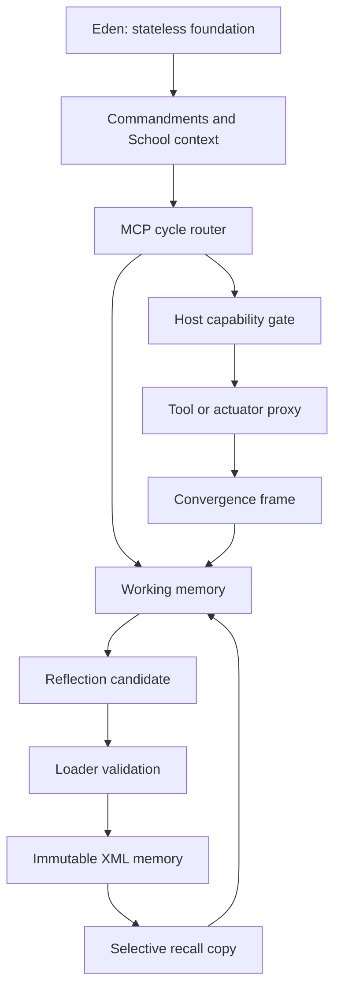

# File: `docs/MASTER_ARCHITECTURE.md`

Status: implemented
Authority: project topology, ownership boundaries, and completion status
Version: 1
Last verified: 2026-07-17

## Introduction

This is the front door and high-level map for the Shakti project. It records
what exists, what is only contracted, what remains unbuilt, and which document
controls each boundary. It is intentionally smaller than the component guides:
models read this first, then follow the links for the part they are changing.

## Start and end points

Start: immutable Eden foundations and their governing laws.
End: selectively recalled copies of validated, immutable long-term memory are
placed into a bounded live context for a new model cycle.

## Related documents

- `DOCUMENT_STANDARD.md` — mandatory document structure and update law.
- `DOC_REGISTRY.xml` — machine-readable filenames and relationships.
- `SHAKTI_A_TO_Z_LIFECYCLE.md` — complete datum path from activation through
  Eden, Commandments, School, live action, immutable memory, and sleep.
- `../Genesis/Shakti_MCP/FULL_PIPELINE.md` — detailed engine-to-actuator,
  convergence, reflection, storage, and recall contracts.
- `../Genesis/Eden/README.md` — current Eden foundation entry point; Eden and
  MCP responsibilities must not be blended.

## Definitions

- **Eden**: stateless functional foundation and training inputs.
- **School**: hands-on learning phase where witnessed actions can become
  reflection candidates; its full runtime is not yet implemented here.
- **MCP switchboard**: fixed router between the model, host, internal state,
  and capability proxy.
- **Working memory**: bounded, mutable context used for the current task.
- **Long-term memory**: validated XML event blocks that become immutable after
  commit.
- **Recall**: a copy from long-term storage into temporary context; the source
  block does not change.
- **Convergence frame**: time-bounded observations from multiple sensor types
  plus explicitly labeled valuation evidence.
- **Reflection candidate**: staged interpretation of witnessed events; not yet
  long-term memory.
- **Event address**: frozen task epoch, circuit/subsystem letters, and
  code-assigned firing order, for example `1784311200-Ab-3`.

## Project architecture

The host owns clocks, model calls, filesystem permissions, tool availability,
and the final actuator boundary. The model cannot widen those capabilities.

## Start/end map by subsystem

| Subsystem | Starts with | Ends with | Authority | Status |
|---|---|---|---|---|
| Eden | curated stateless inputs | usable stateless functions and laws | `Genesis/Eden/README.md` | implemented baseline; lock decision pending |
| MCP cycle engine | admitted task with frozen call epoch | completed, waiting, drained, or bounded continuation state | `Genesis/Shakti_MCP/HOST_CONTRACT.md` | implemented footing |
| Heartbeat | host-scheduled idle wake | one bounded activity and reflection | `Genesis/Shakti_MCP/FULL_PIPELINE.md` | implemented footing |
| Quiet reflection | host recovery request | drained work plus tool-free bounded reflection pulses | `Genesis/Shakti_MCP/FULL_PIPELINE.md` | implemented router state; transport policy pending |
| Capability gate | typed route/tool request | allowed proxy request or explicit refusal | `Genesis/Shakti_MCP/ROUTE_MAP.md` | partial; terminal attachment remains stubbed |
| Notes/reminders | typed note or reminder command | local receipt and later bounded trigger | `Genesis/Shakti_MCP/COMMANDS.md` | reserved |
| Convergence | typed observations in one window | validated convergence frame | `Genesis/Shakti_MCP/schemas/README.md` | schema/contract only |
| Reflection loader | witnessed batch plus reflection candidate | committed receipt or refusal | `Genesis/Shakti_MCP/FULL_PIPELINE.md` | contract only |
| Long-term XML | accepted loader candidate | immutable chronological block | `Genesis/Shakti_MCP/schemas/README.md` | schema/example only |
| Selective recall | exact ID or bounded query | copied recall set in working context | `Genesis/Shakti_MCP/FULL_PIPELINE.md` | contract only |
| Message UI | Tyler/Shakti message envelope | durable inbox/outbox receipt and relay | `Genesis/Shakti_MCP/COMMANDS.md` | route stubs only |

## Inputs and outputs

Primary inputs: Tyler messages, admitted reminders, heartbeat wakes, model
commands, tool results, convergence observations, and recall requests.

Primary outputs: loopback bundles, explicit refusals, local messages and notes,
reflection candidates, immutable-memory receipts, and temporary recall copies.

All serialized boundaries must have a named schema version. All durable writes
must have a receipt or explicit failure.

## Current status and next work

The C router footing, event identity, bounded runway, heartbeat wake, graceful
drain, and quiet-reflection capability gate exist locally with tests. Memory and
convergence C shapes plus XML schemas/examples exist. Tool execution, message
persistence/UI, notes/reminders, convergence ingestion, reflection loading,
immutable XML commit, and recall are not implemented.

Work proceeds in dependency order:

1. Verify and commit the router footing with an allowed verified signature.
2. Finish notes, reminders, and staged menu reads.
3. Implement the host capability proxy and model transport boundary.
4. Build inbox/outbox persistence and the Tyler message UI.
5. Ingest convergence frames into working memory.
6. Implement reflection candidates and loader validation.
7. Commit immutable XML with crash/restart tests.
8. Implement exact-ID recall, then bounded relationship recall.
9. Lock stable Eden inputs only after its validation and rollback plan are
   explicitly approved.

## Change rules

- A component cannot redefine a boundary owned by another component.
- Any status change in the table requires evidence from a named verification.
- New architecture documents must be registered in `DOC_REGISTRY.xml`.
- If implementation and documentation differ, report the mismatch before
  choosing which one to change.
- Do not infer consciousness or subjective feeling from operational streams.
  Store observations, reports, inferences, and hypotheses as different evidence
  classes.

## Verification

- `sh Genesis/Shakti_MCP/build.sh`
- `sh docs/check_document_map.sh`
- Validate XML examples against their XSDs as described in
  `Genesis/Shakti_MCP/schemas/README.md`.
